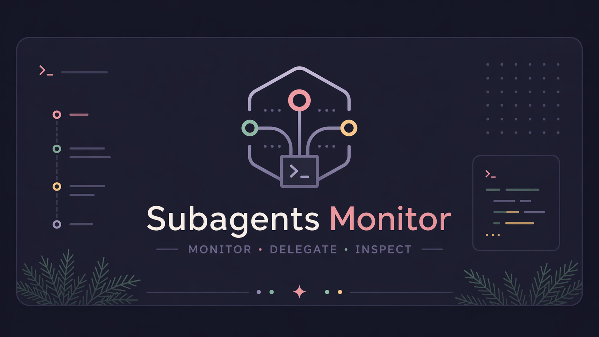
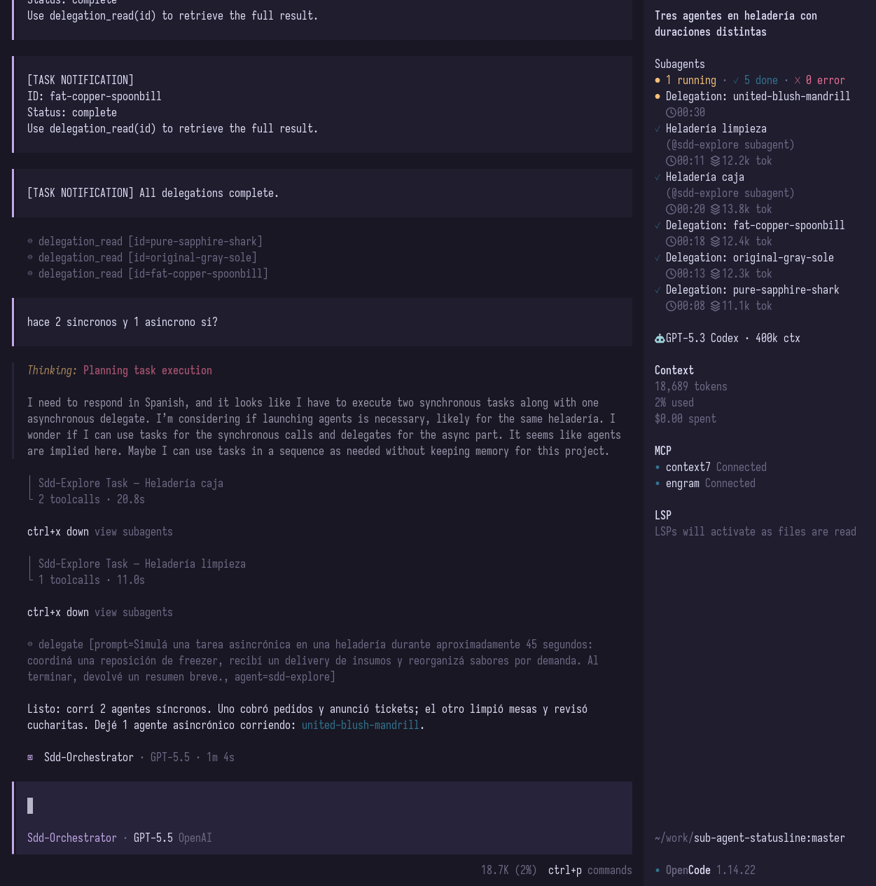
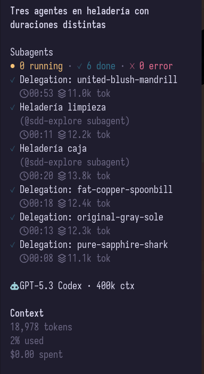

# opencode-subagent-statusline



**Subagent Monitor for OpenCode.**

See what your subagents are doing without losing track of them: running, done, failed, elapsed time, and token/context usage when OpenCode exposes it.

This package works as both:

- a **TUI sidebar plugin** for OpenCode
- a **runtime/statusline plugin** that writes state files for custom integrations

---

## Why?

When you delegate work to subagents, they can disappear into the background. That is powerful, but it also makes it easy to lose visibility:

- Is the review agent still running?
- Did the test agent finish?
- Which child session failed?
- How much context did a subagent use?

`opencode-subagent-statusline` adds a compact **Subagent Monitor** inside OpenCode so you can keep that information visible while you work.

---

## Screenshot



Focused sidebar view:



---

## Install

Add the plugin to your OpenCode TUI config:

```json
{
  "$schema": "https://opencode.ai/tui.json",
  "plugin": ["opencode-subagent-statusline"]
}
```

Your TUI config usually lives at:

```txt
~/.config/opencode/tui.json
```

Restart OpenCode after editing the file.

---

## What you get

The TUI plugin adds a sidebar section that shows:

- running subagents
- completed subagents
- failed subagents
- elapsed time
- token/context usage when available

It also adds a small home/footer summary when there is active subagent activity.

---

## Runtime/statusline mode

If you also want file output for a custom statusline or external integration, add the runtime plugin to your OpenCode config:

```json
{
  "plugin": ["opencode-subagent-statusline/runtime"]
}
```

This writes:

- `state.json` — machine-readable subagent state
- `status.txt` — compact text output

Example statusline text:

```txt
↳ 2 running · 1 done · 0 error · tests 01:23 ctx 12.4k tok · reviewer 00:41
```

By default, files are written under:

```txt
${XDG_RUNTIME_DIR ?? os.tmpdir()}/opencode-subagent-statusline/pid-${process.pid}/
```

---

## Local development

Install dependencies:

```sh
pnpm install
```

Build the plugin:

```sh
pnpm build
```

Test the local TUI build by pointing OpenCode directly at `dist/tui.js`:

```json
{
  "$schema": "https://opencode.ai/tui.json",
  "plugin": [
    "/absolute/path/to/sub-agent-statusline/dist/tui.js"
  ]
}
```

For local runtime/statusline testing:

```json
{
  "plugin": [
    "/absolute/path/to/sub-agent-statusline/dist/index.js"
  ]
}
```

---

## Development notes

This project ships two plugin surfaces:

- `src/tui.tsx` → OpenCode TUI sidebar plugin
- `src/index.ts` → runtime/statusline file-output plugin

The TUI bundle is built with `tsup` and `esbuild-plugin-solid` in Solid `universal` mode for OpenTUI compatibility.

Package entrypoints:

```txt
opencode-subagent-statusline          -> TUI plugin
opencode-subagent-statusline/tui      -> TUI plugin
opencode-subagent-statusline/runtime  -> runtime/statusline plugin
```

Useful commands:

```sh
pnpm build
pnpm typecheck
pnpm pack --dry-run
```

---

## Troubleshooting

### The plugin does not show up

Check OpenCode logs:

```sh
grep -n "subagent-statusline\|failed to load tui plugin" ~/.local/share/opencode/log/*.log
```

Then restart OpenCode after changing `tui.json`.

### I installed a new version but OpenCode still behaves like the old one

OpenCode may be using a cached package. Try clearing the cached package directory under:

```txt
~/.cache/opencode/packages/
```

Then restart OpenCode.

### Token/context usage is missing

OpenCode event payloads can vary by version and by event type. The plugin shows token/context usage when it is available and safely omits it when it is not.

---

## License

MIT
